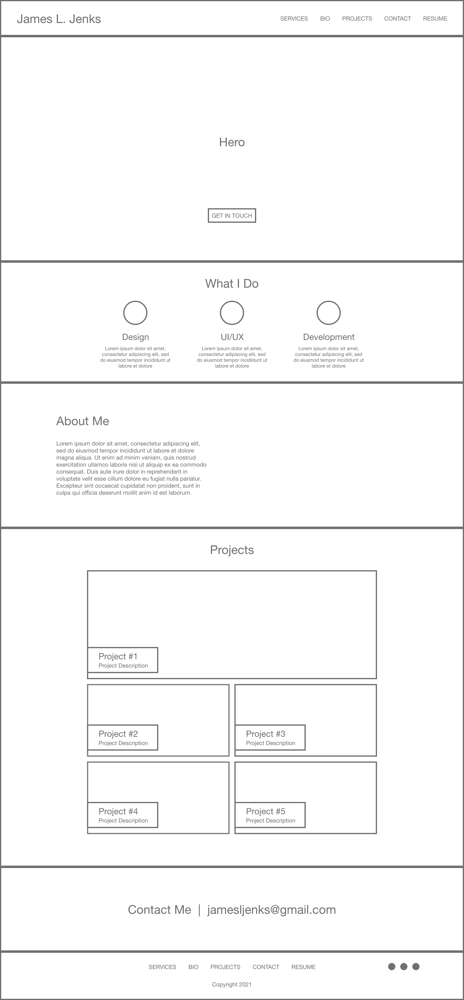
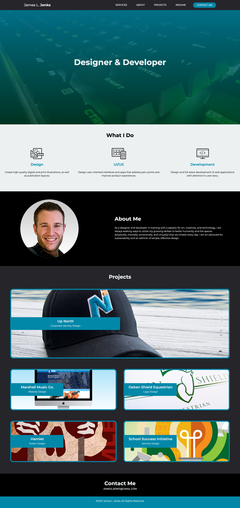
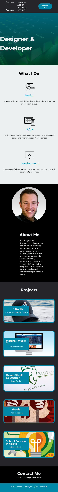

# 02_Portfolio
## Description

The objective for this project was to create a portfolio site that demonstrated a working knowledge of the concepts learned during the week of the 02 Unit - Advanced CSS, as well as the HTML/CSS curriculum that was covered in the previous week. In my approach to designing and buidling the landing page, I wanted to ensure I implemented core concepts taught at the beginning of the course: user story and acceptance criteria.

While I used the provided acceptance criteria to complete the site, I wanted to ensure I was thorough in developing the user story. Since this was a professional portfolio site intended to be presented to prospective employers, I decided to tailor the design to match my personal brand. This process involved the creation of a wireframe that would ultimately serve as a blueprint for establishing the site structure and building it out.

## Table of Contents

- [Acceptance Criteria](#acceptance-criteria)
- [Screenshots](#screenshots)
- [Link](#link)
- [Credits](#credits)
- [License](#license)
## Acceptance Criteria
AS AN employer

I WANT to view a potential employee's deployed portfolio of work samples

SO THAT I can review samples of their work and assess whether they're a good candidate for an open position

GIVEN I need to sample a potential employee's previous work

WHEN I load their portfolio

THEN I am presented with the developer's name, a recent photo, and links to sections about them, their work, and how to contact them

WHEN I click one of the links in the navigation

THEN the UI scrolls to the corresponding section

WHEN I click on the link to the section about their work

THEN the UI scrolls to a section with titled images of the developer's applications

WHEN I am presented with the developer's first application

THEN that application's image should be larger in size than the others

WHEN I click on the images of the applications

THEN I am taken to that deployed application

WHEN I resize the page or view the site on various screens and devices

THEN I am presented with a responsive layout that adapts to my viewport

## Screenshots
This is a screenshot of the low-fidelity wireframe I created as a guide for the project. The wireframe gave me an opportunity to lay out the header, sections, and elements that would contain the content and images.

The final site design utilized a dark neutral color palette and was responsive.

Mobile Version

## Link

This is a link to the deployed application: https://jamesljenks.github.io/02_Portfolio/
## Credits
Trilogy Education Services
YouTube: Skillthrive https://www.youtube.com/watch?v=PwWHL3RyQgk&t=631s
YouTube: Web Zone https://www.youtube.com/watch?v=URTDznfBisY
W3 Schools: https://www.w3schools.com/
MDN Web Docs: https://developer.mozilla.org/en-US

## License

This project was created by James L. Jenks as part of the curriculum for the MSU Coding Boot Camp and Trilogy Education Services.

© 2021 James L. Jenks, All Rights Reserved.
    